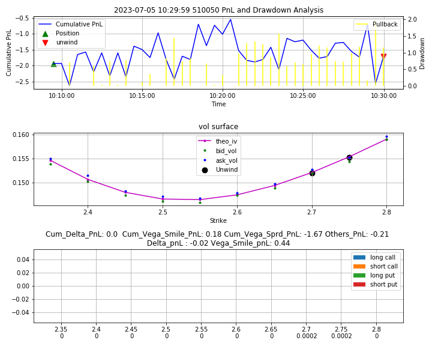

# Vol_Surface_Mean_Reversion
Assuming the volatility surface fitted by SVI model reflects theoretical implied volatility, then we can compare the market iv with the theoretical iv. Build a portfolio long the option whose iv is lower than the vol surface and short the option whose iv is higher than the vol surface.

## Table of Contents
- Data Preparation
- Data Cleaning
- SVI model and calibration
- Strategy Implementation
- Post Strategy Analysis
- Testing Results
- Where to go from here
## Data Preparation
All the data preparation is in the TickQuotation module.  
**timeseries** generates time series from 10:00:00 to 15:00:00 with 0.5s frequency.  
**tickquotation** loads csv files from data/underlying/intraday and read csv files of the price info of different codes to dataframes.  
**ETFOptionChain** loads csv files from data/underlying/static_file and read csv files of the contract info(i.e strikes, expiry, code info) to dataframes. 
**ETFOptionQuotation**  conbines option and underlying pricing info and the static info together for each tick time.

## Data Cleaning
Check **optionpricing** under **PricingEngine**
With all data ready, we need to clean the data: 
 - Filtered all the OTM options
 - Calculated the implied volatility(mid/bid/ask iv)
 - Step1: delete the options with expire less than 1 day
 - Step2: delete the options with 0.0001 quote
 - Step3: delete the options with 0 volume，but the market is so illquid...
 - Step4:dispose the options whose Bid1=Ask1
 - Filtered until this step, we can use this OTM_option dataframe to arbitrage 
 - Step5: dispose the options whose Bid1 and Ask1 differ more than 25bp  
  Ideally, 0 and 1 expiry bid-ask sprd smaller than 10bp, 2 and 3 expiry bid-ask sprd smaller than 20bp
 - Step6: Delete the call spread arbitrage points
 - Step7:for every expire_date, calculate the #num of options, if some expire date whose #num of option is less than 20% of the median, then delete all the options under the expire date
 - Step8: Delete the options with iv less than 50% of the median iv or more than twice of the median iv

## SVI Model and Calibration
Check out:
https://www.math.kth.se/matstat/seminarier/reports/M-exjobb14/140909.pdf#:~:text=The%20stochastic%20volatility%20inspired%2C%20or%20SVI%2C%20model%20of,%5B1%5D%20as%20reasons%20for%20its%20popularity%20amongst%20practitioners.
  I used .xll in excel to access the SVI model, check **vol_surface** under **Market_Taking_Strategy**

## Strategy Implementation
With the data feed into the SVI model, we fit the model and get our 'theo vol'. 
  Check out the **strategy**  
- trading signal: 
  - We measured two options existed:one low(ask under the smile) and one high(bid above the smile), then we chose two options deviated the smile the most. Long low and short high.
  - (Bid/Ask - theo) - bid-ask sprd > 0 for both low and high option
  - Strikes of these two options with in 0.05. This guarantee the &#916;vol of these two options are roughly equal so that vega neutral can do the vega hedging job
- Unwind:
  - Unwind for profit: for both options, we need the bid below the smile and ask above the smile(mean reversion); we need the &#916; (bid/ask_iv-theo_iv) > bid_ask sprd to secure a profit
  - Stop loss: if we do not unwind for profit for 20 mins, just run, it will not mean reversion anymore
- Delta Hedging:
  - synthetic forward
- Vega Hedging:
  - vega neutral

After the strategy, it's neutral to do the backtesting, since we do not know which options to trade beforehand, so the datafeed does not fit any backtesting structure. Considering this, I built my own backtesting structure.

## Post Strategy Analysis
Now if we run the Test_Strategy.py(this is my backtesting structure), we can get the comprehensive plot of Cumulative PnL and drawdown, Vol Surface, and Position(x-axis contains both strike and basprd).  
(Noted: At the strikes I do not have position, the bid-ask sprd I set 0 cuz I do not care)  

If you do not see the positions here(just blank), that's totally normal cuz I just unwind my positions either because of I triggered my unwind signal or stop loss signal.  

The most important thing in Post Strategy Analysis is PnL Breakdown:  
- Total PnL = Cum_Delta_PnL + Cum_Vega_PnL + Others
(Noted: Since this is a somewhat high frequency strategy, we do not consider second order greeks PnL)  
Since we use synthetic forward to delta hedging, Cum_Delta_PnL should be close to 0.  
- Cum_Vega_PnL = Cum_Vega_smile_PnL + Cum_Vega_Sprd_PnL (Noted: through trading only two options' strikes within 0.05 which is the closest you can find in the market, we can assume it's close to 0 just using the vega neutral to determine the size)  
- Cum_Vega_Sprd_PnL = vega_low * size_low * &#916; sprd_vol_low + vega_high * size_high * &#916; sprd_vol_high  
(Noted: &#916; sprd_vol_low = bid_theo_vol - bgn_ask_theo_vol, &#916; sprd_vol_high = ask_theo_vol - bgn_bid_theo_vol)

After we did the PnL Breakdown, it's straightforward to see why some days the strategy does not work out:

Take the example of 2022-09-19 50ETF:  
Cum_Vega_Sprd_PnL is -4.54 and it unwinds becasue of stop loss rather than triggering the unwind signal, which means the market did not mean reversion although triggered trading signal very quickly(at 10:01:00). It does the strategy can only work when the market is liquid but act weird sometimes(so the trading signal can be triggered)

However, on 2023-04-024 50ETF:  
Cum_Vega_Sprd_PnL is 4.66. It unwinds in 30s after the triggered the trading signal. This works because market corrects itself quickly just in 30s.

## Testing Results
For 50 ETF the second expiry(next month):  
2.7% intraday return on 2019-12-23 for 50ETF. Triggered trading signal but not unwind signal.  
-19% intraday return on 2020-10-12 for 50ETF. Triggered trading signal but not unwind signal.  
-98% intraday return on 2022-09-19 for 50ETF. Triggered trading signal but not unwind signal.  
15.8% intraday return on 2023-04-24 for 50ETF.  

In early days, the market is illquid and it's hard for the market to mean reversion, so it's easy to trigger the trading signal but it never unwind(It always triggered the stop loss signal)  

In 2023, most of the time(I have tested about 20 days from the end of April to June), the trading signal will not be triggered and there will be no trades in the day. This is because market is fairly liquid throughout the day and it's hard to capture the abnormal time

## Where to go from here
Just some ideas to extend the strategy:  

- Data processing:
  - How you process data can make a huge difference in model fitting
  - I just filtered data so it reduces the data significantly, especially through the liquidity check(bid-ask sprd). Are there any ways you can fill in some data?  
    - You can induce additional OTM options from the corresponding ITM options(with in the 25bp bid-ask sprd of course)
- Model extension:
  - How about other models that market makers frequent uses such as Wing Model? 
- Strategy extension:

  - more frequent: Since I set observe the market every 30s, I may lose some market opportunities. 
  - more expiry: Test the strategy with different expiries and see which one is stablest.
  - smarter and customized stop loss: Although my trading signal can secure a profit if the market do the mean reversion, the liquidity is not promised so the stop loss can be designed smarter. If you entered the market fairly early (say at 10:01) and at the time that the market is fairly liquid.  
  From experience, 10 am should be an actively trading time, so if this time we triggered the trading signal, maybe it means the market is illquid today and it will not mean reversion(it will only go more illquid just like the days we lost money).
  

    

  
